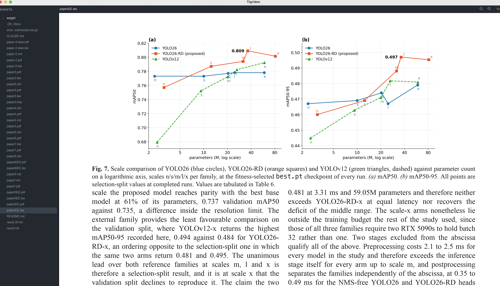

# Tigriden — Terminal for Agentic Coding

  

**A tiny desktop IDE built for one job: supervising AI coding agents.**

Run `claude`, `codex`, `gemini` — any terminal agent — each in its own folder, side by side. Every workspace gets an embedded terminal, a live file tree, and a lightweight code editor so you can watch and steer what your agents build. No run/debug tooling, no chat panel, no LSP: the agents do the heavy lifting, Tigriden gives you eyes and hands.

Written in pure Rust. **~10 MB binary, ~40 MB RAM.**



*Above: a real session — the agent's workspace file tree on the left, the built-in viewer inspecting a chart the agent just generated, and the agent CLI running in one of three terminal tabs below.*

## Why

Agentic coding means running several agents in several folders and checking in on them. A full IDE is overkill for that; a bare terminal multiplexer gives you no file browser and no editor. Tigriden is the minimal middle: **one window, one session per folder, agent + files + editor together.**

## Features

- **One-click agents** — preset buttons type the agent command into the terminal for you (fully configurable).
- **Multiple terminals per folder** — the `+` tab spawns extra shells in the same workspace, so one agent can run while you use a second terminal for git, tests, or another agent.
- **Real terminal** — VTE-compliant emulation ([alacritty_terminal](https://crates.io/crates/alacritty_terminal) + a real PTY). TUIs like `vim`, `top`, and the Claude Code interface just work, including bracketed paste and truecolor. Select with the mouse and Cmd+C to copy out; Cmd+V pastes text in, and image paste into Claude Code works with Ctrl+V (the agent reads your clipboard directly).
- **Live file tree** — gitignore-aware, refreshes automatically as agents create and delete files. Right-click any entry for New File/Folder, Reveal in Finder, Open in Default App, Copy (Relative) Path, Duplicate, Rename, and Move to Trash.
- **Drag & drop files** — drop any file from Finder onto the window and its (shell-quoted) path is typed into the terminal, so you can attach files to an agent prompt the same way as in a native terminal.
- **Built-in editor** — syntax highlighting for 40+ languages ([cosmic-text](https://crates.io/crates/cosmic-text) + syntect), edit and Cmd+S save. When an agent edits the open file on disk, it reloads automatically (or asks, if you have unsaved changes).
- **File viewers** — images (png/jpg/gif/webp/bmp/tiff), Markdown rendered with headings, code blocks and inline pictures, CSV/TSV as an aligned table, and PDF text extraction. A header button toggles Markdown/CSV between the rendered view and editable source.
- **Per-folder sessions** — each workspace keeps its own shell, tree, and open file; switching is instant.
- **Recent folders** — every folder you add is remembered permanently; reopen from the ⟳ button or **File ▸ Open Recent**, even after removing it from the workbench.
- **Native menu bar** — File (Add Folder ⌘O, New Terminal ⌘T, Open Recent, Save ⌘S, Close Terminal ⌘W, Close Folder ⇧⌘W) and Edit (Copy/Paste/Select All) menus, routed to whichever pane has focus.
- **Persistent** — folders, active session, and layout are restored on relaunch (fresh shells each time, by design).
- **Small on purpose** — no webview, no Electron, no C regex libraries. Slint UI with both panes rasterized straight to pixel buffers.

## Quick install (macOS)

No Rust needed — grab the prebuilt app from the [latest release](https://github.com/Sompote/Tigriden/releases/latest):

1. Download **`Tigriden-0.1.0-macos-universal.app.zip`** (one download for both Apple Silicon and Intel).
2. Unzip and drag **Tigriden.app** into **/Applications**.
3. First launch only: the app isn't notarized, so **right-click → Open → Open**, or run:

   ```sh
   xattr -d com.apple.quarantine /Applications/Tigriden.app
   ```

Prefer a bare binary? The release also ships `tigriden-0.1.0-macos-arm64.tar.gz` (Apple Silicon) and `tigriden-0.1.0-macos-x86_64.tar.gz` (Intel) — untar and run `./tigriden`.

<details>
<summary><b>Build from source</b> (stable Rust required)</summary>

```sh
git clone https://github.com/Sompote/Tigriden.git
cd Tigriden
cargo build --release
./target/release/tigriden        # or ./bundle/make-app.sh for dist/Tigriden.app
```

macOS is the primary target; Linux/Windows are untested but the stack is cross-platform.
</details>

## Usage

1. Click **+ Add folder** and pick a project directory — a login shell opens there.
2. Click a preset button (e.g. **claude**) to launch the agent, or type any command.
3. Watch the file tree update as the agent works; click any file to inspect or tweak it.
4. Click **+** in the terminal tab strip to open more terminals in the same folder (each tab is its own shell; ✕ on hover closes one).
5. Add more folders to run more agents in parallel; switch by clicking a session in the sidebar. The ✕ on a session header removes the folder from the workbench (its shells are stopped; the folder stays in Recent).
6. Click **⟳** (bottom of the sidebar) to reopen any previously added folder without the file dialog.

### Keys

| Context  | Keys |
|----------|------|
| Terminal | everything a terminal expects: Ctrl+C/Z/D/R…, arrows, F1–F12, TUIs; drag to select (double-click = word), Cmd+C copies, Cmd+V pastes (bracketed); wheel scrolls history |
| Editor   | typing, arrows / Home / End / PgUp / PgDn (+Shift selects, +Alt jumps words), Cmd+A / C / X / V, Cmd+S saves |

## Configuration

`~/Library/Application Support/tigriden/config.toml`, created on first run:

```toml
theme = "dark"          # "dark" | "light"
font_family = "Menlo"
font_size = 13.0
scrollback = 10000

[[presets]]
label = "claude"
command = "claude"
send_enter = true

[[presets]]
label = "codex"
command = "codex"

[[presets]]
label = "gemini"
command = "gemini"
```

Runtime state (restored folders, split position) lives next to it in `state.toml`.

## Architecture

Slint provides only the chrome (sidebar, layout, splitter). The two hard parts are custom-rendered pixel panes on the CPU:

| Pane | Engine | Rendering |
|------|--------|-----------|
| Terminal | headless `alacritty_terminal` grid fed by `portable-pty` | glyphs rasterized per cell via cosmic-text's swash cache |
| Editor | cosmic-text `SyntaxEditor` (syntect highlighting) | draws itself into the same pixel-buffer canvas |

Only the PTY reader threads run in the background; rendering and editing happen on the UI thread with coalesced repaints.

`vendor/cosmic-text/` is a verbatim copy of cosmic-text 0.19 with one change: its syntect dependency uses the pure-Rust `fancy-regex` engine instead of the oniguruma C library (smaller binary, no C build dependency).

### Debug builds

`cargo build --features framedump`, then run with `TIGRIDEN_DUMP=/tmp/frames` to dump both panes as PNGs. `TIGRIDEN_TEST_INPUT='claude\r'` and `TIGRIDEN_TEST_OPEN=path` script the first session for headless testing.

## Roadmap / known limitations (v1)

- [ ] Editor undo
- [ ] Mouse reporting to TUIs
- [ ] IME / dead-key composition
- [ ] Editor tabs (currently one open file per session)
- [ ] PDF page rendering (currently text extraction)
- [ ] Linux / Windows testing

## License

MIT
